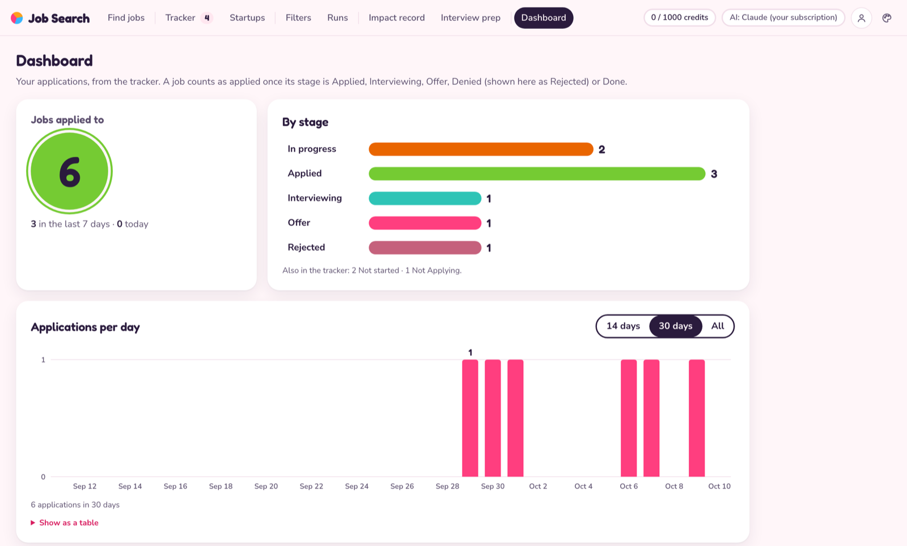
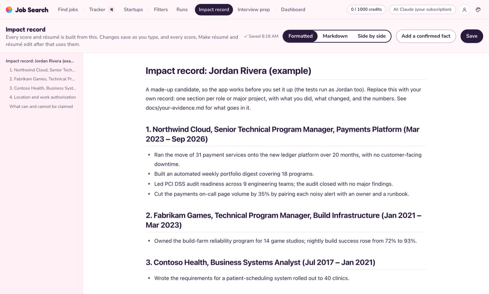

# Job Search

**A job-hunting assistant that runs on your Mac.** It finds new job postings, tells you how well each one fits your experience, writes a tailored résumé for the good ones, and keeps track of every application.

**Download for Mac:** [Apple silicon (M1 or later)](https://github.com/Alexander-C-Carnes/job-search-app/releases/latest/download/Job-Search-arm64.dmg) · [Intel](https://github.com/Alexander-C-Carnes/job-search-app/releases/latest/download/Job-Search-x86_64.dmg) · [What's new](https://github.com/Alexander-C-Carnes/job-search-app/releases/latest) · [All releases](https://github.com/Alexander-C-Carnes/job-search-app/releases)

## What it does for you

- **Finds jobs.** Save searches (titles, remote or hybrid, location, pay) and it pulls new postings from [JobsPipe](https://jobspipe.dev). It also watches startups that just raised money and reads their careers pages.
- **Scores the fit.** Each job gets a 1–10 score against your real experience, with your strongest matches and likely gaps.
- **Writes the résumé.** For a job worth applying to, it drafts three résumés, keeps the best parts of each and checks the result, then hands you a polished PDF in one of five layouts, plus a report on what it matched.
- **Stays honest.** Every line on a résumé has to trace back to something you actually wrote down. When a job asks for something you haven't shown, it asks you a question instead of making something up.
- **Tracks your applications.** A board from *Not started* to *Offer*, a dashboard of what you've sent, and an optional sync with Notion.
- **Never applies for you.** You read the résumé, you apply, and you mark the job Applied.

## Get started

### 1. Download the app

| Your Mac | Download |
|---|---|
| Apple silicon (M1 or later) | [Job-Search-arm64.dmg](https://github.com/Alexander-C-Carnes/job-search-app/releases/latest/download/Job-Search-arm64.dmg) |
| Intel | [Job-Search-x86_64.dmg](https://github.com/Alexander-C-Carnes/job-search-app/releases/latest/download/Job-Search-x86_64.dmg) |

Not sure which you have? Apple menu → **About This Mac** → **Chip** (Apple M-something means Apple silicon).

These links always get the newest version. To read what changed, see the [latest release](https://github.com/Alexander-C-Carnes/job-search-app/releases/latest). Every earlier version, with its notes and DMGs, is on the [Releases page](https://github.com/Alexander-C-Carnes/job-search-app/releases). A new release goes out once a day when something has changed.

### 2. Install it

1. Open the DMG and drag **Job Search** into **Applications**.
2. Open **Job Search**. If macOS says it can't check the app for malicious software, go to **System Settings → Privacy & Security**, scroll down and click **Open Anyway**. You only need to do this once.
3. The app opens in your browser with a made-up example person, Jordan Rivera, so you can look around first.

### 3. Make it yours

All of this happens inside the app.

1. **Connect an AI.** Click the round person button at the top right to open **Profile**, then go to **AI**. If you have a Claude Pro or Max plan, click **Sign in to Claude…** and nothing costs extra. (If it says Claude Code isn't installed, install the [Claude app](https://claude.ai/download) first.) You can also [use ChatGPT, Gemini or a free local model](docs/choosing-an-ai.md).
2. **Say who you are.** On the same **Profile** tab, fill in your name and contact line, and add your résumé with **Add a résumé** (a PDF, Word file or text).
3. **Write your impact record.** This is the step that matters most. In the **Impact record** tab, replace Jordan's with your own: every role or big project, what you did, and what changed because of it, with numbers wherever you have them. The app can only use what's written here. [Here's what makes a good one.](docs/your-evidence.md)
4. **Start finding jobs.** Get a [JobsPipe](https://jobspipe.dev) key (the free plan gives you 1,000 jobs to start), paste it under **Profile → Other keys**, and set up your searches in the **Filters** tab. Even without a key you can add jobs by pasting their link, and browse the **Startups** tab.

Then pick a job and try the three actions:

| | What it does | How long |
|---|---|---|
| **Signal score** | A quick 1–10 read on how well you fit | ~30 seconds |
| **Full score** | Every requirement checked against your record, with a heat map and gaps to fill | a few minutes |
| **Make résumé** | A tailored, checked résumé PDF and a fit report | ~25 minutes |

The fit report ends with questions about anything you haven't shown yet. Answer them with **Add a confirmed fact** in the **Impact record** tab, and the next résumé can use what you said.

## What it costs

- **The app:** free and open source.
- **The AI:** nothing extra with a Claude Pro or Max plan; the work counts toward your plan's usage. With other providers you pay per use, and a model running on your Mac is free.
- **Finding jobs:** JobsPipe charges one credit per job it finds. The free plan gives you 1,000 credits once, every search has a limit so you don't burn through them, and you never pay twice for the same job in a month. Adding jobs by link and the Startups tab are free.
- **Notion:** optional.

## Your data stays yours

Everything about you (your record, résumés, keys, and every job and application) is kept in one folder on your Mac, `~/JobSearch`. Your record and résumés go only to the AI you choose, your searches go to JobsPipe, and your tracker goes to Notion only if you turn that on. Updating the app never touches that folder. **Back it up**: it's the only copy.

## More screenshots

| Dashboard | Impact record |
|---|---|
|  |  |

Don't like pink? Pick a different look (Sorbet, Transit, Bauhaus, Arcade or Classic) with the palette button at the top right.

## Learn more

| Guide | What's in it |
|---|---|
| [Your evidence](docs/your-evidence.md) | How to write your impact record and add your résumés |
| [Using the app](docs/using-the-app.md) | Every tab and button, the tracker and Notion sync |
| [Which AI does the work](docs/choosing-an-ai.md) | Claude, ChatGPT, Gemini, OpenRouter or a local model, and what changes |
| [How it works](docs/how-it-works.md) | The scoring and résumé pipeline, the honesty checks, where files live |
| [Run it from the code](docs/setup-from-code.md) | Setup with git and Python, Notion, searches, keeping it updated |
| [Reference](docs/reference.md) | Command line, searches, startup sources, JobsPipe credits, tests |

## Questions

**Does it apply to jobs for me?** No. It stops before submitting. Each résumé comes with a checklist of the link, the PDF to attach and the posting's hard requirements.

**Will it make things up?** It's built not to. Every claim has to trace back to your impact record, your résumés or facts you've confirmed. Each résumé is checked for figures your evidence doesn't contain, and when you ask it to change a résumé in a way your record doesn't support, it says no and tells you why.

**Does it work on Windows or Linux?** The download is for macOS. You can [run it from the code](docs/setup-from-code.md) on Linux, but that isn't tested.

**How do I update it?** When there's a new version, the app offers it when you open it. Click **Download**, quit the old one, and drag the new one into Applications. You can also get it any time from the [latest release](https://github.com/Alexander-C-Carnes/job-search-app/releases/latest). Your files aren't affected.

## License

[MIT](LICENSE)
