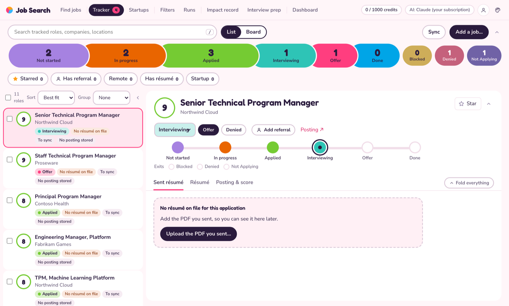

# Using the app



## What each action is called

The app uses one name for each thing it can do to a job, and **What each does** (next to the buttons) explains them:

| Name | Time | What it does |
|---|---|---|
| **Signal score** | ~30 seconds, one Claude call | A quick 1–10 read on how well your impact record fits the posting, with the strongest matches and likely gaps. |
| **Full score** | a few minutes, about four calls | Rates every requirement against your impact record and each résumé: a 1–10 score, a heat map and the gaps to confirm. No résumé is written. |
| **Make résumé** | ~25 minutes, about eleven calls | The full score (reused if there is one), three drafts, the best merged and checked, a PDF and a fit report. While it runs, the job's badge fills with its progress and time left. On the command line it's `tailor`. |

Searches (the **Filters** tab): **Check filters** (≤1 credit per filter), **Search + signal score**, and **Search + make résumés for top N**.

## Starting and stopping it (when you run it from the code)

The Mac app needs none of this: open it from Applications, and quit it with ⌘Q.

```bash
./jobsearch install      # once: makes `jobsearch` work from any folder
jobsearch run            # start the app and open it (if it's already running, just open it)
jobsearch update         # get the latest code and packages
jobsearch go             # update, then run (restarting the app if it's running on an older version)
jobsearch restart        # stop the app and start it again, e.g. after merging a change
```

Runs going in the app (a search, Make résumé) carry on through `restart` and `go`: each run is its own process, saving what it prints and how it ended in `data/tracker.db`, and the restarted app picks it up, along with the runs that were waiting their turn. Add `--force` to stop them too. Quitting is different: Ctrl+C in the app's window (or closing the window) stops the runs, and with runs going the first Ctrl+C says so and a second one quits. Restarting from a new Terminal window stops the app in the old one and runs it in the new one. (An app started before this change can't keep its runs through a restart, so `restart` still waits for them the first time.)

The app opens at `http://127.0.0.1:8765/?token=…`; keep its Terminal window open (Ctrl+C stops it). The first run sets up `.venv` (Python packages and the PDF browser), and packages are reinstalled whenever `requirements.txt` changes, so nothing needs activating. `./start.sh` is the same as `jobsearch run`. On a Mac, `python` alone isn't a command outside `.venv`; use `python3` or `.venv/bin/python`.

Bookmark the URL it prints; the token in it stays the same until you delete `data/web-token`.

## The tabs

| Tab | What it does |
|---|---|
| **Tracker** | The jobs you're tracking, kept on this Mac and synced with your Notion "Apply to Job" rows (see "The tracker and Notion" below). Search by role, company or location (press `/`); the stage strip counts and filters Not started / In progress / Blocked / Applied / Interviewing / Offer / Denied (you applied and were turned down, e.g. not offered an interview) / Done / Not Applying (jobs you've ruled out: a poor fit, or little chance of an interview. They stay in the tracker so searches don't bring them back, and they aren't counted in the tab's open total); the **Starred**, **Has referral**, **Remote** (fully remote only, not hybrid) and **Has résumé** chips narrow it further. **Group: Company** puts each company's roles together under a heading with their count and stages (click a heading to fold it; the setting and folded companies are remembered); on the board it labels each company within a column. **List** shows a role beside its detail; **Board** shows one column per stage, and dragging a card to another column sets its Status. Star a role with the star (or `s`; `j`/`k` move through the list). **Add referral** saves a link (and optionally a name) for the person referring you. |
| **Dashboard** | Your applications at a glance, from the tracker. **Jobs applied to** counts every job at Applied, Interviewing, Offer, Denied or Done, with how many in the last 7 days and today. **By stage** draws In progress, Applied, Interviewing, Offer and Rejected (the Denied stage) to scale; click one to open those jobs in the Tracker. **Applications per day** charts the last 14 or 30 days, or all of them (hover or tab to a day for its jobs; **Show as a table** lists them). A job's day is its Notion **Due/Submitted** date when that is set and not in the future, else the day its stage first became Applied or later, here or in Notion (moving it back to an earlier stage clears it). Jobs applied to before the dashboard existed got the day their tracker row last changed. Each look dresses it its own way: Sorbet's total is a scoop and the stages candy bars, Transit's a departures board over cased line segments, Bauhaus's a huge count on a yellow field, Arcade's a score counter over pixel HP bars. |
| **Find jobs** | New jobs from your filters that aren't in your tracker yet, with the same search, chips, stars and scoring. Filter New / Fit 7+ / Dismissed. **Track** adds a job to the tracker (Not started) and moves it to the Tracker tab; **Dismiss** hides it (see Dismissed to undo). Make résumé also tracks the job: it moves to In progress as soon as the run starts (from Not started; a later stage stays). Filters don't add jobs to Notion on their own unless you set `notion.log_triaged_min_fit` in `searches.yaml`. **Add a job…** is for roles you find yourself: paste the posting's link and the app reads the title, company, location and description from the page (Greenhouse, Lever, Ashby, Workday, LinkedIn and most careers pages). If the page can't be read, paste the description. A link you already have opens that job instead of adding it twice. The job lands here, to score or tailor. |
| **Startups** | Startups that just raised a round, and which round. **Refresh sources** (free, about a minute, shown in Runs) reads funding news (Google News searches for "raises Series A/B/C/seed/pre-seed", plus the FinSMEs, TechCrunch, Crunchbase News and AlleyWatch feeds; a headline like "Acme raises $20M Series B" becomes the company, the amount and the round), the YC directory (companies that say they're hiring, with their batch), and VC portfolio job boards (General Catalyst, Techstars, Accel, Insight Partners, Khosla Ventures) searched for your filters' titles, each company with its stage. Views: **Raised recently** (a round in the last 90 days), **YC hiring**, **All**, **Dismissed**; round chips (Pre-seed … Series D+, Growth, Unknown) narrow the list. Open roles come on their own: each refresh first stores every matching role it already holds (the VC boards list roles with each company), then reads the startups' careers boards (Greenhouse, Lever or Ashby, found from each website; no JobsPipe credits), raises first and then startups that say they're hiring, up to 300 a refresh. Every role that answers one of your filters (its title, and not a sales, pre-sales, support or junior variant of it; remote or one of the filter's locations; not pinned to another region) is added to Find jobs with its round. With `startups.roles.signal_score: true`, each new one is scored against your impact record as it arrives, so **Fit 7+** filters them by your experience; with `startups.roles.track_min_fit: 7` as well, a role scoring 7 or more goes straight to the tracker (Not started) instead of waiting in Find jobs, and `python -m jobpipe startups track` adds the ones scored before you set it. Each refresh also re-checks that the roles in Find jobs are still open and moves closed ones to Dismissed, tagged Closed. **Hiring for you** lists the startups with such a role. While the app is open it refreshes the sources on its own once a day (`startups.auto_refresh_hours`). A startup's page shows the round, the headline it came from (a headline the app read, so check the article before quoting it), where it was seen, and its open roles; **Find open roles** reads its board again now, and **Add to Find jobs** stores a role that didn't match. **Track company** adds an "Open roles — Acme" card to the tracker with the round while you watch for the right role. **Look up the round** asks Fundable, TheirStack or People Data Labs (a key in `.env`; all have free allowances) for a startup the news didn't cover. **Add a startup…** adds one you heard of by name and website. Settings are the `startups:` section of `searches.yaml`: how recent a raise counts, the feeds and searches, YC batches/industries/regions, the VC boards, keywords, how many boards a refresh reads (`roles`), how often it refreshes on its own, and how many unknown rounds to look up per refresh. Kept in `data/startups.json`. |
| **Posting & score** (inside a job) | The posting, formatted for reading, with two scores beside it. **Signal score** is the quick check: one Claude call rates each requirement in the posting against your impact record and confirmed facts, and the app turns that coverage into a 1–10 score (about 60% is 6, 70% is 7, 80–90% is 8, above that 9). It lists the strongest matches, hard requirements to check and likely gaps; open "Covers N%…" to see each rated requirement. Location, relocation and work authorization are listed as things to check and never lower the score. **Full score** runs stages 1–2 of the Make résumé pipeline (about four calls, a few minutes): every requirement rated against the impact record and each résumé, the ATS scorecard for your existing résumés, a heat map and the gaps to confirm. Make résumé reuses it later. Both work for stored jobs, pasted jobs and jobs that are only in Notion (the posting is read from its page). Scoring a job doesn't track it (click **Track** for that) unless `notion.log_triaged_min_fit` is set (for a startup role, `startups.roles.track_min_fit`), in which case a signal score at or above it does, as a pipeline run would. If Claude can't run, the reason stays on screen (for example, that the CLI needs `/login`). |
| **Batch scoring and résumés** (either list) | Tick rows (or the box above the list for everything shown) and choose **Signal score**, **Full score** or **Make résumé**, or click **Signal-score N unscored**. Jobs are queued on the server, three signal scores at a time, one full score at a time; the list shows progress and **Stop the rest** drops the ones still waiting. The fit tile shows the full score where there is one (marked with a bar under the number), otherwise the signal score. **Make résumé** asks first (each is about eleven Claude calls), then queues one run per role: three at a time, the rest waiting their turn with a dashed ring, each listed in Runs. Roles that already have a résumé, have one being made, or have no posting stored are skipped. A role with a résumé shows a page icon under its star, on the row and the board card; clicking it opens the Résumé tab. |
| **Résumé** (inside a job) | The PDF, its version history, and **Chat with Claude** (via your subscription): a conversation about this résumé and role that remembers what you've said. Ask a question ("what would a recruiter question here?") and Claude answers without touching the résumé; ask for a change, or say yes to one Claude suggested, and it returns the revised résumé plus a note on what changed, the evidence behind it, and any risk (such as a title you haven't held). Enter sends; **New chat** starts over (versions are kept), and the conversation is saved in the run's `versions/chat.json`. The app re-renders the PDF, runs `check_resume.py` and the keyword score, and shows a highlighted diff. Nothing is saved until you click **Accept**; accepted edits become v2, v3, … and also update `resume-final.md` and the deliverable PDF. **Restore** brings back any earlier version. **Edit on page** (above the PDF) lets you change the wording yourself: the résumé is drawn in the PDF's layout, you click a line and type, and **Save** keeps it as a new version, re-renders the PDF and runs the same checks. Dashed lines show roughly where the pages break. **Edit as text** opens the markdown for changes the page can't make, such as adding a bullet or a job. A résumé made elsewhere can be edited this way too. |
| **Sent résumé** (inside a job) | The exact PDF sent with an application, for every job marked Applied, Interviewing, Offer, Denied or Done (rows without one are tagged **No résumé on file**). Marking a job Applied (or a later stage) keeps the app's current résumé for it (the version is noted) unless one is already on file; **Upload the PDF you sent…** or **Replace…** adds any PDF, and **Use the app's résumé** saves the current version. It's kept in `data/sent/`, so later edits never change it, and sent to the Notion row's **Resume Used** on the next sync, unless that already holds a file, which is never replaced. A file added in Notion's Resume Used shows here too. |
| **Résumé made elsewhere** (inside a job) | A tracked job the app didn't make a résumé for (for example, one you made with the `resume-job-fit` skill in a Claude chat) shows a résumé from `resume-runs/<company>-<role>/` or `references/resume-*.md`. The app picks the one whose file name matches the job's company and title (every word of `acme-staff-tpm` in "Acme · Staff TPM"); use the menu above the PDF to pick another, or none. It's copied into `data/linked/`, so version history and edits never change the repo. A skill run folder can be edited by chatting with Claude; a saved résumé on its own can't, because it has no posting or match brief. |
| **Fit report / Heat map** | The report and interactive heat map from Make résumé. The report ends with **Questions before I finalize**, one per unconfirmed gap: answer them with **Add a confirmed fact** in the **Impact record** tab, then make the résumé again. A full score also makes a heat map. Before either has run, these tabs say so and offer the button that fills them. |
| **Filters** | Your saved JobsPipe searches, called filters in the app. **New filter** adds one (its id is made from the name); **Edit**, **Duplicate** and **Delete** change one at a time. Each change is written to `searches.yaml` at once, comments kept. Tick which to run, then **Preflight**, **Search + score**, or **Search + score + tailor top N**; the bar shows the most credits the run can spend. **Show request** on a card shows the exact request it sends JobsPipe, with the defaults filled in (free). **Search once**, in the New/Edit filter dialog, runs what's in the dialog without saving it: up to its jobs-per-run in credits, plus a quick score of each new job unless you untick **Score what it finds**. Its jobs show in Find jobs as found by `one-off`. |
| **Runs** | Live output of the runs going now and earlier runs. Up to three run at once, so you can make several résumés side by side; searches still go one at a time (they spend credits), and one job's résumé can't be made by two runs at once. A signal or full score shows on the job, not here. The bar at the top shows how many are going. When a run ends, **Results** above its output lists each job it scored or made a résumé for, with buttons that open the job's Fit report, Résumé or posting. |
| **Impact record** | Your impact record (`references/impact-record.md`), with an outline of its sections. **Formatted** shows it like Typora: formatted text you edit in place, where markdown you type (`## `, `- `, `**bold**`) turns into formatting. **Markdown** shows the text, and **Side by side** the text with a preview; ⌘/ switches between Formatted and Markdown. Blocks you didn't touch are saved exactly as they were, so a save changes only what you edited. It saves a moment after you stop typing, on ⌘S and when you switch tabs. If the file was changed elsewhere meanwhile, nothing is overwritten: a banner offers to load that version or save yours over it. The text a save replaces is kept in `data/impact-record-history/`. **Add a confirmed fact** answers a fit report's follow-up question: it saves your edits, then adds the answer, dated and marked user-confirmed, to the record's `# Confirmed facts` section at the end (making the section if there isn't one), and every later score and résumé edit uses it at exactly the scope you wrote. |
| **Profile** | Who the résumés are for: your name, pronouns and contact line, the PDF file-name prefix, and which résumés in `references/` to score against (tick them, name each one, pick the fallback; **Add a résumé** uploads a `.md`). Saved to the `candidate:` section of `searches.yaml`, comments kept; not while a run is going. |

Stars and referral links are kept in `data/marks.json`; they are not written to Notion.

**The tabs** sit in groups: **Find jobs** | **Tracker**, **Startups** | **Filters**, **Runs** | **Impact record**, **Interview prep** | **Dashboard**. **Profile** is the round person button at the top right.

**Looks.** The **Look** card at the top of Profile (or the palette button in the top bar) picks how the app looks on this computer: **Sorbet** (the default: candy colours, round shapes, the stage strip as a ribbon of scoops sized by count; confetti on Applied), **Transit** (the pipeline as a transit line with stations and exits, a departures-board list; a split-flap board on Applied), **Bauhaus** (flat colour fields, huge black counts, a strict grid; a green wipe on Applied), **Arcade** (a daylight 8-bit HUD with the pipeline as an XP bar; "APPLICATION SENT! +100 XP" on Applied) or **Classic** (the original compact grey). Each has its own sad cat for Denied. Every look has the same tabs, buttons and shortcuts; the choice is kept in the browser, not in `searches.yaml`. Each look also has its feedback moments: marking a role **Applied** fires confetti from the Applied scoop and a banner that counts what's out the door, **Interviewing** a smaller burst (Transit's board reads NEXT STOP · INTERVIEW, Arcade's BOSS FIGHT!, Bauhaus wipes violet), **Offer** the biggest one of all (TERMINUS · OFFER, YOU WIN! +1000 XP, a pink OFFER! field), **Done** a smaller one, and **Denied** brings a sad fat cat with how many roles are still in play. A role's header shows where it stands on the line (Not started, In progress, Applied, Interviewing, Offer, Done, and which exit it took), with the usual next move beside the status menu (**Mark applied**; after applying **Interviewing** or **Denied**; then **Offer**, then **Mark done**; **Back to in progress** from an exit), and the Résumé tab draws the fit, résumé, ATS and keyword scores as meters. The looks are stylesheets in `jobpipe/web/static/themes/` (fonts bundled, so nothing loads from outside), their moments live in `static/theme.js`, and `prefers-reduced-motion` turns the confetti off.

**The round chip.** A role whose company is in the Startups tab, by website or by name, shows its funding round on the row, the board card and the job header (`Series B $20M`; `YC W26` when only the batch is known), with the headline it came from a click away. The **Startup** chip filters either list to those roles. Tracking the role puts the round in the tracker's Notes line and the Notion page body, so it reads "Triaged … · Series B · $20M · Oct 2026 (FinSMEs)".

The impact-record editor is [Milkdown](https://milkdown.dev) (MIT), bundled into `jobpipe/web/static/vendor/editor.js` so the app works offline and loads no outside scripts. To change it, edit `tools/editor/editor.js`, then run `npm install && npm run build` in `tools/editor/`.

The job list is served from memory: job files and `state.json` are re-read only when they change on disk, and tracked jobs come from the local tracker, so the list never waits on Notion.

### The tracker and Notion

The tracker lives in `data/tracker.db` (SQLite) on this Mac. That file is the source of truth for which jobs are tracked and their status, so **Track** and status changes are instant and work when Notion can't be reached. Notion is a synced copy:

- A change made in the app, or by a pipeline run, is saved locally and queued. The next sync sends it to Notion. Rows waiting are marked **To sync**, and the header says how many changes are waiting.
- Each sync then reads Notion. Jobs added there (for example by the `resume-job-fit` skill) appear in the app, and a status edited in Notion replaces the local one. If both sides changed the same job's status before a sync, the app's change wins.
- A row deleted in Notion is removed here on the next sync. A job with no URL stays local, because Notion rows are matched by Job URL.
- The app syncs in the background about once a minute while it's open, right after each change, and when you click **Sync**. If Notion is failing, the header says so and nothing is lost.

Without `NOTION_TOKEN` (or with `notion.enabled: false`) the tracker works the same, on this Mac only. On first run it starts from the app's last Notion snapshot (`data/notion-cache.json`), if there is one.

The edit loop follows the same honesty rules as the pipeline: every claim must trace to the impact record, your confirmed facts, or the job's evidence ledger, the do-not-claim list is binding, and Claude declines (and says so) when an instruction asks for something the evidence doesn't support.

Security: the server listens on 127.0.0.1 only, rejects requests that aren't addressed to localhost, and every API call needs the token. Job pages render posting text as plain text, and the fit report escapes any HTML in it.

## Applying

The pipeline stops before submitting. For each tailored job, `apply-*.md` has the link, the PDF name, the posting's hard constraints and a checklist. Submit yourself, or have Claude in Chrome fill the form and stop for your review; answer work authorization, self-identification and certification questions yourself. Then set Status to Applied and Resume Used in Notion.
